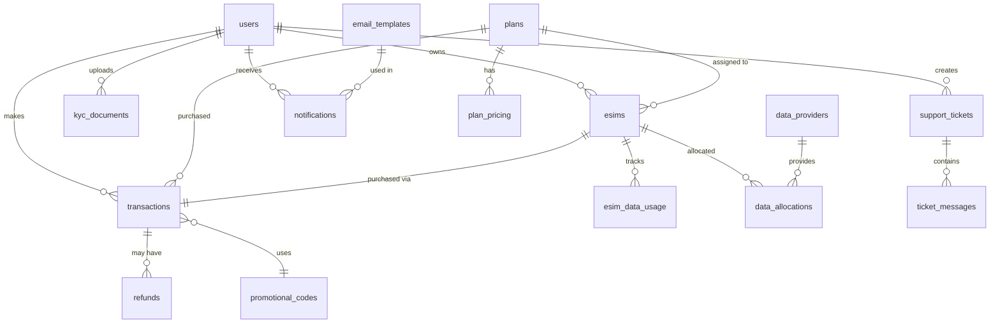

# Database Schema - eSIM Admin Panel

## Overview
This document outlines the complete database schema for the eSIM reselling admin panel. Each table corresponds to specific UI screens and features.

---

## 1. Users & Authentication

### `users`
**UI Screen**: User Management → User List, User Profile

| Column | Type | Constraints | Description |
|--------|------|-------------|-------------|
| id | UUID | PRIMARY KEY | Unique user identifier |
| email | VARCHAR(255) | UNIQUE, NOT NULL | User email address |
| password_hash | VARCHAR(255) | NOT NULL | Hashed password |
| first_name | VARCHAR(100) | NOT NULL | User first name |
| last_name | VARCHAR(100) | NOT NULL | User last name |
| phone | VARCHAR(20) | | Phone number |
| status | ENUM | NOT NULL | active, inactive, suspended, banned |
| role | ENUM | NOT NULL | customer, admin, super_admin, support |
| kyc_status | ENUM | DEFAULT 'pending' | pending, verified, rejected |
| created_at | TIMESTAMP | DEFAULT NOW() | Account creation date |
| updated_at | TIMESTAMP | DEFAULT NOW() | Last update date |
| last_login | TIMESTAMP | | Last login timestamp |

**Indexes**: `email`, `status`, `role`, `created_at`

---

### `kyc_documents`
**UI Screen**: User Management → KYC Management

| Column | Type | Constraints | Description |
|--------|------|-------------|-------------|
| id | UUID | PRIMARY KEY | Document ID |
| user_id | UUID | FOREIGN KEY → users.id | User reference |
| document_type | ENUM | NOT NULL | passport, id_card, drivers_license, utility_bill |
| document_url | TEXT | NOT NULL | S3/Cloud storage URL |
| status | ENUM | DEFAULT 'pending' | pending, approved, rejected |
| verified_by | UUID | FOREIGN KEY → users.id | Admin who verified |
| verified_at | TIMESTAMP | | Verification timestamp |
| rejection_reason | TEXT | | Reason if rejected |
| uploaded_at | TIMESTAMP | DEFAULT NOW() | Upload timestamp |

**Indexes**: `user_id`, `status`

---

## 2. eSIM Management

### `esims`
**UI Screen**: eSIM Management → eSIM Inventory, Active eSIMs

| Column | Type | Constraints | Description |
|--------|------|-------------|-------------|
| id | UUID | PRIMARY KEY | eSIM ID |
| iccid | VARCHAR(22) | UNIQUE, NOT NULL | eSIM ICCID (SIM card number) |
| eid | VARCHAR(32) | | eSIM identifier |
| user_id | UUID | FOREIGN KEY → users.id | Assigned user |
| plan_id | UUID | FOREIGN KEY → plans.id | Associated plan |
| twilio_sid | VARCHAR(100) | UNIQUE | Twilio SIM SID |
| status | ENUM | NOT NULL | available, active, suspended, expired, cancelled |
| activation_code | VARCHAR(100) | | Activation code |
| qr_code_url | TEXT | | QR code image URL |
| activated_at | TIMESTAMP | | Activation timestamp |
| expires_at | TIMESTAMP | | Expiration date |
| created_at | TIMESTAMP | DEFAULT NOW() | Creation date |
| updated_at | TIMESTAMP | DEFAULT NOW() | Last update |

**Indexes**: `iccid`, `user_id`, `status`, `twilio_sid`

---

### `esim_data_usage`
**UI Screen**: eSIM Management → Data Usage Monitor

| Column | Type | Constraints | Description |
|--------|------|-------------|-------------|
| id | UUID | PRIMARY KEY | Usage record ID |
| esim_id | UUID | FOREIGN KEY → esims.id | eSIM reference |
| data_used_mb | DECIMAL(10,2) | NOT NULL | Data consumed in MB |
| data_limit_mb | DECIMAL(10,2) | | Data limit in MB |
| voice_minutes | INTEGER | DEFAULT 0 | Voice minutes used |
| sms_count | INTEGER | DEFAULT 0 | SMS count |
| period_start | TIMESTAMP | NOT NULL | Billing period start |
| period_end | TIMESTAMP | NOT NULL | Billing period end |
| recorded_at | TIMESTAMP | DEFAULT NOW() | Record timestamp |

**Indexes**: `esim_id`, `period_start`, `period_end`

---

## 3. Plans & Pricing

### `plans`
**UI Screen**: Pricing & Plans → Plan Builder

| Column | Type | Constraints | Description |
|--------|------|-------------|-------------|
| id | UUID | PRIMARY KEY | Plan ID |
| name | VARCHAR(100) | NOT NULL | Plan name (e.g., "5GB Global") |
| description | TEXT | | Plan description |
| data_limit_mb | DECIMAL(10,2) | | Data limit in MB (NULL = unlimited) |
| voice_minutes | INTEGER | DEFAULT 0 | Included voice minutes |
| sms_count | INTEGER | DEFAULT 0 | Included SMS count |
| validity_days | INTEGER | NOT NULL | Plan validity in days |
| regions | JSONB | | Supported regions/countries |
| is_active | BOOLEAN | DEFAULT true | Plan availability |
| created_at | TIMESTAMP | DEFAULT NOW() | Creation date |
| updated_at | TIMESTAMP | DEFAULT NOW() | Last update |

**Indexes**: `is_active`, `created_at`

---

### `plan_pricing`
**UI Screen**: Pricing & Plans → Pricing Strategy

| Column | Type | Constraints | Description |
|--------|------|-------------|-------------|
| id | UUID | PRIMARY KEY | Pricing ID |
| plan_id | UUID | FOREIGN KEY → plans.id | Plan reference |
| region | VARCHAR(50) | | Region code (e.g., "US", "EU", "GLOBAL") |
| cost_price | DECIMAL(10,2) | NOT NULL | Cost from Twilio/provider |
| selling_price | DECIMAL(10,2) | NOT NULL | Customer selling price |
| markup_percentage | DECIMAL(5,2) | | Markup % |
| currency | VARCHAR(3) | DEFAULT 'USD' | Currency code |
| effective_from | TIMESTAMP | NOT NULL | Price effective date |
| effective_to | TIMESTAMP | | Price end date (NULL = current) |
| created_at | TIMESTAMP | DEFAULT NOW() | Creation date |

**Indexes**: `plan_id`, `region`, `effective_from`

---

### `promotional_codes`
**UI Screen**: Pricing & Plans → Promotional Pricing

| Column | Type | Constraints | Description |
|--------|------|-------------|-------------|
| id | UUID | PRIMARY KEY | Promo code ID |
| code | VARCHAR(50) | UNIQUE, NOT NULL | Promo code |
| discount_type | ENUM | NOT NULL | percentage, fixed_amount |
| discount_value | DECIMAL(10,2) | NOT NULL | Discount value |
| max_uses | INTEGER | | Maximum usage count |
| used_count | INTEGER | DEFAULT 0 | Current usage count |
| valid_from | TIMESTAMP | NOT NULL | Valid from date |
| valid_to | TIMESTAMP | NOT NULL | Valid to date |
| applicable_plans | JSONB | | Array of plan IDs (NULL = all) |
| is_active | BOOLEAN | DEFAULT true | Active status |
| created_at | TIMESTAMP | DEFAULT NOW() | Creation date |

**Indexes**: `code`, `is_active`, `valid_from`, `valid_to`

---

## 4. Payments & Transactions

### `transactions`
**UI Screen**: Payment Management → Payment Dashboard, Transaction List

| Column | Type | Constraints | Description |
|--------|------|-------------|-------------|
| id | UUID | PRIMARY KEY | Transaction ID |
| user_id | UUID | FOREIGN KEY → users.id | Customer reference |
| esim_id | UUID | FOREIGN KEY → esims.id | Associated eSIM |
| plan_id | UUID | FOREIGN KEY → plans.id | Purchased plan |
| amount | DECIMAL(10,2) | NOT NULL | Transaction amount |
| currency | VARCHAR(3) | DEFAULT 'USD' | Currency code |
| payment_method | ENUM | NOT NULL | credit_card, paypal, crypto, bank_transfer |
| payment_gateway | VARCHAR(50) | | stripe, paypal, etc. |
| gateway_transaction_id | VARCHAR(255) | | External transaction ID |
| status | ENUM | NOT NULL | pending, completed, failed, refunded, cancelled |
| promo_code_id | UUID | FOREIGN KEY → promotional_codes.id | Applied promo |
| discount_amount | DECIMAL(10,2) | DEFAULT 0 | Discount applied |
| tax_amount | DECIMAL(10,2) | DEFAULT 0 | Tax amount |
| total_amount | DECIMAL(10,2) | NOT NULL | Final amount |
| invoice_url | TEXT | | Invoice PDF URL |
| created_at | TIMESTAMP | DEFAULT NOW() | Transaction date |
| completed_at | TIMESTAMP | | Completion timestamp |

**Indexes**: `user_id`, `status`, `created_at`, `gateway_transaction_id`

---

### `refunds`
**UI Screen**: Payment Management → Refund Processor

| Column | Type | Constraints | Description |
|--------|------|-------------|-------------|
| id | UUID | PRIMARY KEY | Refund ID |
| transaction_id | UUID | FOREIGN KEY → transactions.id | Original transaction |
| amount | DECIMAL(10,2) | NOT NULL | Refund amount |
| reason | TEXT | | Refund reason |
| status | ENUM | NOT NULL | pending, processed, failed |
| processed_by | UUID | FOREIGN KEY → users.id | Admin who processed |
| gateway_refund_id | VARCHAR(255) | | External refund ID |
| created_at | TIMESTAMP | DEFAULT NOW() | Refund request date |
| processed_at | TIMESTAMP | | Processing timestamp |

**Indexes**: `transaction_id`, `status`, `created_at`

---

## 5. Integrations

### `twilio_config`
**UI Screen**: Integrations → Twilio Configuration

| Column | Type | Constraints | Description |
|--------|------|-------------|-------------|
| id | UUID | PRIMARY KEY | Config ID |
| account_sid | VARCHAR(100) | UNIQUE, NOT NULL | Twilio Account SID |
| auth_token_encrypted | TEXT | NOT NULL | Encrypted auth token |
| api_key | VARCHAR(100) | | Twilio API key |
| api_secret_encrypted | TEXT | | Encrypted API secret |
| webhook_url | TEXT | | Webhook endpoint |
| is_active | BOOLEAN | DEFAULT true | Active status |
| last_sync_at | TIMESTAMP | | Last sync timestamp |
| created_at | TIMESTAMP | DEFAULT NOW() | Creation date |
| updated_at | TIMESTAMP | DEFAULT NOW() | Last update |

---

### `data_providers`
**UI Screen**: Integrations → Data Provider Management

| Column | Type | Constraints | Description |
|--------|------|-------------|-------------|
| id | UUID | PRIMARY KEY | Provider ID |
| name | VARCHAR(100) | NOT NULL | Provider name |
| api_endpoint | TEXT | NOT NULL | API base URL |
| api_key_encrypted | TEXT | NOT NULL | Encrypted API key |
| provider_type | VARCHAR(50) | | Provider category |
| priority | INTEGER | DEFAULT 1 | Failover priority (1 = primary) |
| is_active | BOOLEAN | DEFAULT true | Active status |
| available_data_gb | DECIMAL(10,2) | | Available data pool |
| cost_per_gb | DECIMAL(10,2) | | Cost per GB |
| created_at | TIMESTAMP | DEFAULT NOW() | Creation date |
| updated_at | TIMESTAMP | DEFAULT NOW() | Last update |

**Indexes**: `is_active`, `priority`

---

### `data_allocations`
**UI Screen**: Integrations → Auto-Provisioning

| Column | Type | Constraints | Description |
|--------|------|-------------|-------------|
| id | UUID | PRIMARY KEY | Allocation ID |
| esim_id | UUID | FOREIGN KEY → esims.id | eSIM reference |
| provider_id | UUID | FOREIGN KEY → data_providers.id | Provider reference |
| allocated_mb | DECIMAL(10,2) | NOT NULL | Allocated data in MB |
| used_mb | DECIMAL(10,2) | DEFAULT 0 | Used data in MB |
| cost | DECIMAL(10,2) | NOT NULL | Allocation cost |
| allocated_at | TIMESTAMP | DEFAULT NOW() | Allocation timestamp |

**Indexes**: `esim_id`, `provider_id`, `allocated_at`

---

## 6. Notifications & Communications

### `email_templates`
**UI Screen**: Notifications → Email Templates

| Column | Type | Constraints | Description |
|--------|------|-------------|-------------|
| id | UUID | PRIMARY KEY | Template ID |
| name | VARCHAR(100) | UNIQUE, NOT NULL | Template name |
| subject | VARCHAR(255) | NOT NULL | Email subject |
| body_html | TEXT | NOT NULL | HTML email body |
| body_text | TEXT | | Plain text version |
| template_type | ENUM | NOT NULL | welcome, purchase, activation, expiry, payment |
| variables | JSONB | | Available variables |
| is_active | BOOLEAN | DEFAULT true | Active status |
| created_at | TIMESTAMP | DEFAULT NOW() | Creation date |
| updated_at | TIMESTAMP | DEFAULT NOW() | Last update |

---

### `notifications`
**UI Screen**: Notifications → Automated Alerts

| Column | Type | Constraints | Description |
|--------|------|-------------|-------------|
| id | UUID | PRIMARY KEY | Notification ID |
| user_id | UUID | FOREIGN KEY → users.id | Recipient user |
| type | ENUM | NOT NULL | email, sms, push, in_app |
| template_id | UUID | FOREIGN KEY → email_templates.id | Template used |
| subject | VARCHAR(255) | | Notification subject |
| message | TEXT | NOT NULL | Notification content |
| status | ENUM | NOT NULL | pending, sent, failed, read |
| sent_at | TIMESTAMP | | Send timestamp |
| read_at | TIMESTAMP | | Read timestamp |
| created_at | TIMESTAMP | DEFAULT NOW() | Creation date |

**Indexes**: `user_id`, `type`, `status`, `created_at`

---

## 7. Support System

### `support_tickets`
**UI Screen**: Support → Ticket List, Ticket Detail

| Column | Type | Constraints | Description |
|--------|------|-------------|-------------|
| id | UUID | PRIMARY KEY | Ticket ID |
| ticket_number | VARCHAR(20) | UNIQUE, NOT NULL | Human-readable ticket # |
| user_id | UUID | FOREIGN KEY → users.id | Customer reference |
| assigned_to | UUID | FOREIGN KEY → users.id | Assigned support agent |
| subject | VARCHAR(255) | NOT NULL | Ticket subject |
| description | TEXT | NOT NULL | Issue description |
| priority | ENUM | DEFAULT 'medium' | low, medium, high, urgent |
| status | ENUM | DEFAULT 'open' | open, in_progress, resolved, closed |
| category | VARCHAR(50) | | Issue category |
| created_at | TIMESTAMP | DEFAULT NOW() | Creation date |
| updated_at | TIMESTAMP | DEFAULT NOW() | Last update |
| resolved_at | TIMESTAMP | | Resolution timestamp |

**Indexes**: `ticket_number`, `user_id`, `assigned_to`, `status`, `priority`

---

### `ticket_messages`
**UI Screen**: Support → Ticket Detail

| Column | Type | Constraints | Description |
|--------|------|-------------|-------------|
| id | UUID | PRIMARY KEY | Message ID |
| ticket_id | UUID | FOREIGN KEY → support_tickets.id | Ticket reference |
| sender_id | UUID | FOREIGN KEY → users.id | Message sender |
| message | TEXT | NOT NULL | Message content |
| attachments | JSONB | | File attachments |
| is_internal | BOOLEAN | DEFAULT false | Internal note flag |
| created_at | TIMESTAMP | DEFAULT NOW() | Message timestamp |

**Indexes**: `ticket_id`, `created_at`

---

### `knowledge_base`
**UI Screen**: Support → Knowledge Base

| Column | Type | Constraints | Description |
|--------|------|-------------|-------------|
| id | UUID | PRIMARY KEY | Article ID |
| title | VARCHAR(255) | NOT NULL | Article title |
| slug | VARCHAR(255) | UNIQUE, NOT NULL | URL slug |
| content | TEXT | NOT NULL | Article content (Markdown) |
| category | VARCHAR(100) | | Article category |
| tags | JSONB | | Search tags |
| views | INTEGER | DEFAULT 0 | View count |
| is_published | BOOLEAN | DEFAULT false | Published status |
| author_id | UUID | FOREIGN KEY → users.id | Author reference |
| created_at | TIMESTAMP | DEFAULT NOW() | Creation date |
| updated_at | TIMESTAMP | DEFAULT NOW() | Last update |

**Indexes**: `slug`, `category`, `is_published`

---

## 8. Analytics & Reports

### `analytics_events`
**UI Screen**: Dashboard → Analytics

| Column | Type | Constraints | Description |
|--------|------|-------------|-------------|
| id | UUID | PRIMARY KEY | Event ID |
| event_type | VARCHAR(100) | NOT NULL | Event name |
| user_id | UUID | FOREIGN KEY → users.id | User reference |
| esim_id | UUID | FOREIGN KEY → esims.id | eSIM reference |
| metadata | JSONB | | Event metadata |
| created_at | TIMESTAMP | DEFAULT NOW() | Event timestamp |

**Indexes**: `event_type`, `user_id`, `created_at`

---

### `revenue_reports`
**UI Screen**: Reports → Financial Reports

| Column | Type | Constraints | Description |
|--------|------|-------------|-------------|
| id | UUID | PRIMARY KEY | Report ID |
| period_type | ENUM | NOT NULL | daily, weekly, monthly, yearly |
| period_start | DATE | NOT NULL | Period start date |
| period_end | DATE | NOT NULL | Period end date |
| total_revenue | DECIMAL(12,2) | NOT NULL | Total revenue |
| total_cost | DECIMAL(12,2) | NOT NULL | Total costs |
| profit | DECIMAL(12,2) | NOT NULL | Net profit |
| transaction_count | INTEGER | NOT NULL | Number of transactions |
| new_users | INTEGER | DEFAULT 0 | New user registrations |
| active_esims | INTEGER | DEFAULT 0 | Active eSIMs count |
| generated_at | TIMESTAMP | DEFAULT NOW() | Report generation time |

**Indexes**: `period_type`, `period_start`, `period_end`

---

## 9. System Settings

### `system_settings`
**UI Screen**: Settings → System Settings

| Column | Type | Constraints | Description |
|--------|------|-------------|-------------|
| id | UUID | PRIMARY KEY | Setting ID |
| key | VARCHAR(100) | UNIQUE, NOT NULL | Setting key |
| value | TEXT | | Setting value |
| data_type | ENUM | NOT NULL | string, number, boolean, json |
| category | VARCHAR(50) | | Setting category |
| description | TEXT | | Setting description |
| is_public | BOOLEAN | DEFAULT false | Public visibility |
| updated_at | TIMESTAMP | DEFAULT NOW() | Last update |

**Indexes**: `key`, `category`

---

## Relationships Summary

---

## Indexes Strategy

- **Primary Keys**: All tables use UUID for better distribution
- **Foreign Keys**: Indexed automatically for join performance
- **Search Fields**: Email, phone, ICCID, ticket numbers
- **Date Ranges**: Created_at, period dates for reporting
- **Status Fields**: For filtering active/inactive records

---

## Data Retention Policy

| Table | Retention Period | Archive Strategy |
|-------|------------------|------------------|
| transactions | 7 years | Move to cold storage after 2 years |
| esim_data_usage | 2 years | Aggregate and archive monthly |
| analytics_events | 1 year | Aggregate to reports, then delete |
| notifications | 90 days | Delete after read + 90 days |
| support_tickets | Indefinite | Archive closed tickets after 1 year |

---

## Security Considerations

1. **Encryption**: All sensitive fields (API keys, tokens) encrypted at rest
2. **PII Protection**: User data encrypted, access logged
3. **PCI Compliance**: Payment data tokenized, never stored directly
4. **Audit Trail**: All critical operations logged with user_id and timestamp
5. **Soft Deletes**: Use `deleted_at` timestamp instead of hard deletes
